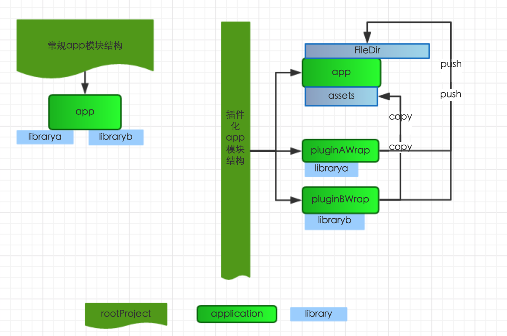

# PluginApp
插件化技术实现App模块化隔离--实践

[系列博客，手摸手教做APP插件化业务解耦一](http://wengyiming.cn/2016/12/05/%E6%89%8B%E6%91%B8%E6%89%8B%E6%95%99%E5%81%9AAPP%E6%8F%92%E4%BB%B6%E5%8C%96%E4%B8%9A%E5%8A%A1%E8%A7%A3%E8%80%A6%E4%B8%80/)

正常app模块结构：

- root gradle
	- app
	- librarya
	- libraryb

插件化后的结构

- app
	- assets	
		- plugina->librarya  
		- pluginb->libraryb
- plugina-wrap 
	- librarya
	
- pluginb-wrap
	- libraryb

参考下图：

将gradle.properties中isDebug设置为true，

	isDebug = true
	
pluginAWrap和pluginBWrap是独立的application，可以直接运行安装运行，测试插件模块，也就是对应的library的功能

将gradle.properties中isDebug设置为false，
	
	isDebug = false
	
只需要执行对应的build task，直接输出`扩展名为jar的apk`到app的assets下作为宿主的插件运行

核心配置只有几行代码，[plugina_wrap 项目的gradle关键配置](https://github.com/fanOfDemo/PluginApp/blob/master/plugina_wrap/build.gradle)：

	import com.android.build.gradle.api.ApkVariant
	
	apply plugin: 'com.android.application'
	
	android {
	
	    sourceSets {
	        main {
	            if (isDebug.toBoolean()) {
	                manifest.srcFile 'src/main/debug/AndroidManifest.xml'
	                java.srcDirs = ['src/main/java']
	            } else {
	                manifest.srcFile 'src/main/release/AndroidManifest.xml'
	                java.srcDirs = ['src/main/plugin/']
	            }
	            assets.srcDirs = ['src/main/assets', 'src/main/assets/']
	        }
	    }
	
	    aaptOptions.additionalParameters '--PLUG-resoure-id', '0x42'
	}
	
	
	dependencies {
	    if (isDebug.toBoolean()) {
	        compile fileTree(dir: 'libs', include: ['*.jar'])
	    } else {
	        provided fileTree(dir: 'libs', include: ['*.jar'])
	    }
	    compile project(':librarya')
	}
	
	
	def nameMap = 'pluginA.jar'
	if (!isDebug.toBoolean()) {
	    android.applicationVariants.all { ApkVariant variant ->
	        def buildTypeName = variant.buildType.name
	        def task = project.tasks.create "jar${buildTypeName.capitalize()}", Jar
	        task.archiveName = nameMap
	        println '______________________________\n__\n\n__________' + task.archivePath
	        task.dependsOn variant.javaCompiler
	        task.outputs.upToDateWhen { false }
	        task.from variant.javaCompiler.destinationDir
	        task.destinationDir = file('../' + 'app/src/main/assets')
	        artifacts.add('archives', task)
	    }
	}

